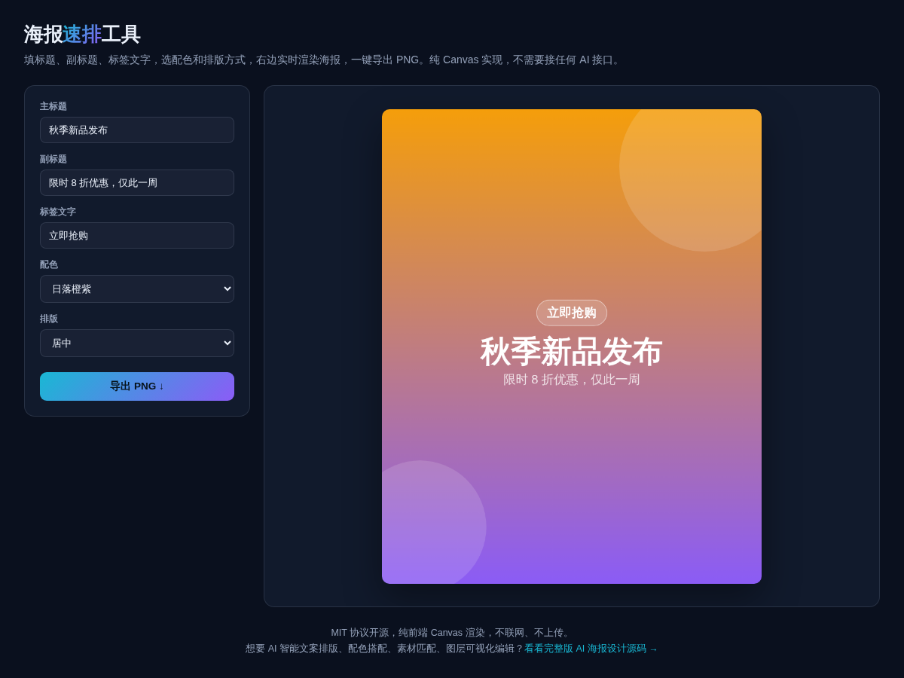

# 海报速排工具 · Poster Maker

**[在线体验 →](https://anna123123123-creator.github.io/poster-maker/)**

免费开源、纯浏览器运行的海报速排小工具。填标题、副标题、标签文字，选一套配色和排版方式，右边 Canvas 实时渲染出海报，一键导出 PNG。不用装软件、不用登录、不联网。



## 试用方法

直接用浏览器打开 `index.html`，或用静态文件服务器跑起来：

```bash
python3 -m http.server 8000
```

## 功能

- 4 套预设配色：日落橙紫 / 深海蓝绿 / 极简暗黑 / 霓虹粉紫
- 3 种排版：居中 / 底部条带 / 对角分栏
- 标题自动换行（按可用宽度逐字换行，中英文都支持）
- 一键导出 800×1000 PNG

## 实现原理

纯 Canvas 2D 绘制：渐变背景 + 装饰性半透明圆形 + 文字排版，没有用任何图形库、没有素材图片依赖。`script.js` 里大概 180 行原生 JavaScript。

## 协议

MIT。

## 相关项目

这个是做 **AI 海报设计**产品时顺手做的免费小工具——固定几套配色和排版模板，不能自由拖拽图层，也不能匹配任意素材图。完整版是 AI 智能文案排版、配色搭配、素材匹配、图层可视化编辑，源码在这：[AI 海报设计网站源码](https://inzyxuashop.com/aihaibao-yuanma.html)。
